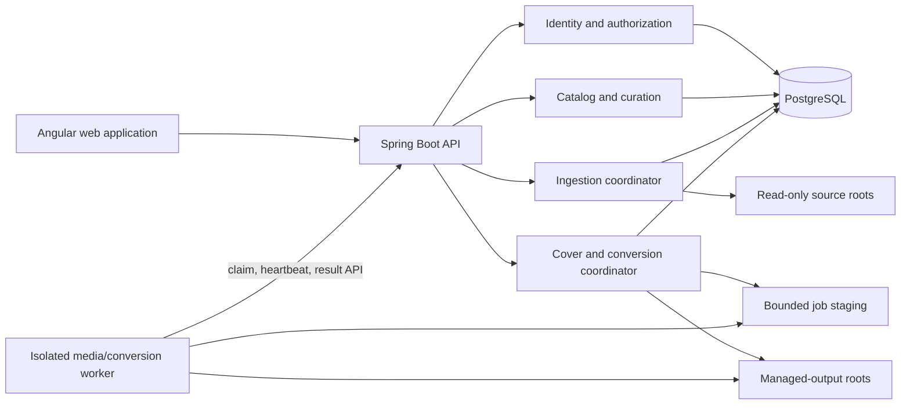

# M2 Curation Design

- Status: Approved
- Date: 2026-09-30
- Design issue: [#41](https://github.com/yurtools/yurlib/issues/41)
- Baseline: `v0.1.0-m1`, ADR-0002 through ADR-0004

## 1. Purpose and approval gate

M2 turns the safe M1 local-library skeleton into a multi-user, curated library without weakening source preservation or bounded processing. This document defines the component boundaries, state ownership, contracts, threats, failure behavior, acceptance evidence, walking skeleton, and implementation order.

The owner approved this document and ADR-0005 through ADR-0010 by merging pull request #62. ADR-0011 subsequently fixed the PDF, DOCX, and DjVu parser boundaries. Exact renderer and converter versions still require dependency and license review in their implementation issues.

## 2. Approved scope

M2 delivers:

- general library-document cataloging through Work → Edition → Asset for EPUB, FB2, MOBI, PDF, DOCX, and DjVu;
- immutable source observations, versioned normalized facts, deterministic resolution, and audited curated overrides;
- contributors, aliases, roles, merge/split recovery, duplicate review, shared catalog tags, and private collections;
- persisted users, session authentication, independently grantable source-manager and curator capabilities, and per-user root denies;
- multiple `READ_ONLY_SOURCE` and `MANAGED_OUTPUT` roots;
- Work-level read/unread state and favorite contributors per user;
- bounded streaming/seeking metadata extraction, cover processing, hashing, and parallel ingestion;
- normalized covers, PDF/DjVu first-page representatives, DOCX package thumbnails, and safe fallbacks;
- a PostgreSQL-backed conversion queue and isolated optional worker for FB2 → EPUB and MOBI → EPUB;
- backup/restore and reference-environment acceptance evidence.

M2 does not deliver full-text or semantic search, document editing, macros or active-content execution, import/copy-in roots, additional database engines, connector/AI workflows, public multi-tenancy, arbitrary conversion routes, or source-file reorganization.

## 3. Quality attributes and reference environment

Priority order is safety and authorization, correctness and recovery, operability, useful incremental results, then throughput. Performance work must preserve the first four.

The reference environment is one Yurlib application instance with 4 CPU cores, 8 GiB RAM, PostgreSQL, x86-64 and ARM64 coverage, local SSD, and a representative SMB root. Cold and warm results are reported separately. Numeric defaults below are initial safe defaults, not universal capacity claims. NFS benchmark evidence is deferred beyond M2 in issue [#70](https://github.com/yurtools/yurlib/issues/70); NFS remains a supported host-mounted source option.

## 4. Component map

`yurlib-server` remains the only database owner. The worker has no database credentials and cannot access source roots. It communicates over an authenticated internal network, reads a per-job staged input, and writes an unpublished result. The server validates and atomically publishes the result.

## 5. Canonical domain and provenance

### 5.1 Core identities

| Entity         | Meaning                                               | Stable rule                                                                            |
| -------------- | ----------------------------------------------------- | -------------------------------------------------------------------------------------- |
| Work           | Intellectual work or general document                 | Survives edition and asset changes; `content_kind` is `BOOK`, `DOCUMENT`, or `UNKNOWN` |
| Edition        | Language, publication, revision, or release of a Work | Identifiers and edition facts do not silently migrate between editions                 |
| Asset          | Exact byte representation, original or derived        | Full SHA-256 establishes byte identity; derivation and lineage are explicit            |
| Asset location | One root-relative location for an Asset               | Availability is separate from catalog identity                                         |
| Contributor    | Person, organization, or unresolved agent             | Roles attach to Work or Edition; aliases never prove identity alone                    |

Exact duplicate bytes may consolidate locations under one Asset. Similar titles, identifiers, filenames, or contributors only create review candidates; they never automatically merge Works or Editions.

### 5.2 Metadata states

Metadata moves through four separate states:

1. `Observation`: immutable value, subject, source Asset, root lineage, source field, parser/version, timestamp, and parse outcome.
2. `Normalized fact`: versioned deterministic transformation such as Unicode normalization, language-code canonicalization, typed identifier classification, or contributor-name parsing. It retains every input observation.
3. `Resolved value`: deterministic selected value plus rule/version, alternatives, conflicts, and confidence category. Confidence is descriptive, not a probability.
4. `Curated override`: curator-authored value with actor, reason, optimistic version, timestamp, prior value, and undo relationship.

Display precedence is current curated override, resolved normalized value, selected raw observation, then an explicitly provisional filename fallback. Absence remains distinct from an empty value. Reprocessing creates new normalized/resolved versions and never mutates observations or active overrides.

### 5.3 Normalization rules

- Titles preserve original Unicode and whitespace evidence; display normalization trims and collapses presentation whitespace but does not transliterate or silently remove subtitles.
- Contributor roles are typed (`AUTHOR`, `EDITOR`, `TRANSLATOR`, `ILLUSTRATOR`, `OTHER`). Name display preserves source order and script; alias matching is not identity proof.
- Language codes normalize to BCP 47 when deterministically possible; invalid or ambiguous values remain observations with a review reason.
- Identifiers are typed (`ISBN_10`, `ISBN_13`, `DOI`, `UUID`, `URI`, `SOURCE_LOCAL`, `OTHER`). Syntax validation does not prove that the identifier describes the current edition.
- Conflicting high-priority values enter a review queue rather than being overwritten.

### 5.4 Curation and recovery

The separately grantable `CURATE_CATALOG` capability permits canonical metadata edits, contributor aliases, merge/split operations, shared tags, and duplicate decisions. The owner has it by default. It is independent from `MANAGE_INGESTION_SOURCES`.

Merge operations select a surviving canonical ID, retain redirects, record a before-image event, move associations transactionally, and preserve observations. Undo is automatic only while no later conflicting edits exist; otherwise the UI provides a guided split preview. “Not the same” duplicate decisions are durable and suppress the same candidate rule/version.

Shared tags are curator-managed catalog taxonomy. Collections are private to a user. A hidden Work remains referenced internally by a private collection but is omitted from visible contents and counts until access returns.

## 6. Identity, sessions, and authorization

### 6.1 Account lifecycle

The first shared-network M2 startup transaction bootstraps a persisted owner from required deployment credentials when no owner exists. After bootstrap, the PostgreSQL credential record is authoritative and deployment credentials no longer authenticate requests. An offline operator recovery command, requiring local deployment control, resets the owner password and increments the account authorization version without logging secrets.

Only the owner can create/disable users, reset credentials, grant/revoke capabilities, and create/remove root denies. Usernames are unique and case-normalized; passwords use the Spring Security adaptive encoder. Disabling a user or reducing authority increments `authorization_version`; every request compares the session version and invalidates stale sessions immediately.

### 6.2 Capabilities

| Capability                 | Owner   | Grantable           | Operations                                                                                    |
| -------------------------- | ------- | ------------------- | --------------------------------------------------------------------------------------------- |
| `OWNER`                    | Always  | No                  | User, credential, capability, and root-deny administration                                    |
| `MANAGE_INGESTION_SOURCES` | Default | By owner            | Configure/remove roots, verify mounts, start/cancel scans, inspect ingestion failures         |
| `CURATE_CATALOG`           | Default | By owner            | Correct metadata, manage aliases/tags, merge/split, resolve duplicates                        |
| Library access             | Default | Constrained by deny | Search, view, cover, download, conversion request, favorites, read state, private collections |

### 6.3 Root-deny projection

Access is allow-by-default with explicit `(user_id, root_id)` deny records. Owner administration is audited. Authorization is enforced in PostgreSQL query predicates and application ports, never only in the Angular client or by post-filtering a page.

- A Work is visible if at least one available Asset location is on an allowed root.
- A denied-only Work is absent from search, counts, identifiers, direct lookup, collections, and error distinctions.
- Denied Assets, locations, raw observations, provenance, covers, downloads, jobs, and diagnostics are hidden.
- Shared canonical/curated metadata remains visible when the Work is otherwise visible.
- Personal state is retained when access is removed but is neither returned nor mutable until access returns.
- A derived Asset is visible only if both its managed-output root and every security-relevant source lineage root are allowed.
- A missing or malformed authorization context fails closed.

The same projection applies to HTTP APIs, background-job reads, export, backup inspection tools, and metrics labels. Tests prove non-disclosure through pagination totals, search suggestions, timing-insensitive status codes, and direct identifiers.

## 7. Roots and storage ownership

M2 removes the M1 singleton constraint and supports multiple roots with exactly one mode:

- `READ_ONLY_SOURCE`: discovery, bounded reads, hashing, and original download; never written by Yurlib.
- `MANAGED_OUTPUT`: covers, conversions, and durable publication; never used as an ingestion source in M2.

Deployment mount aliases still define canonical allowed prefixes. Overlapping canonical paths and symlink escapes are rejected. Every root retains its identity marker, availability, and independent scan history. One managed-output root may be selected as the default for covers and one for conversions; they may be the same root.

Managed paths use opaque IDs and content hashes rather than untrusted titles. Publication writes to a bounded same-filesystem staging path, validates the output and source lineage, fsyncs when supported, then atomically renames. Database publication commits only after the final file is present. Recovery removes unreferenced expired staging files and reconciles published files by manifest/hash; it never deletes originals.

## 8. Bounded ingestion and resource contract

### 8.1 Pipeline and backpressure

Each scan has bounded stages: discovery → stability check → metadata extraction → persistence → optional hashing → optional cover work. PostgreSQL owns durable job and task state. In-process workers claim tasks with `FOR UPDATE SKIP LOCKED`, leases, heartbeats, bounded attempts, and idempotency keys. A process restart expires leases and safely retries.

Default concurrency on the reference environment is one discovery producer, two metadata workers, one hashing worker, one persistence consumer, and one cover/render task. The discovery-to-parse queue is 256 paths and result queue is 128 results. A 512 MiB weighted work-memory pool admits tasks by reservation: 64 MiB metadata, 128 MiB archive-heavy metadata, and 256 MiB image/render work. Concurrency decreases when reservations, open-file permits, database capacity, or cancellation require it; it never exceeds configured hard ceilings.

Per-root fairness uses round-robin task claims with at most half of parse permits consumed by one root when another root has queued work. One active scan per root remains; different roots may scan concurrently. Cancellation stops new claims, interrupts cooperative work, and leaves committed outcomes idempotent.

### 8.2 Initial operation budgets

These are M2 starting defaults. Raising a hard security boundary requires threat review and near/over-limit fixtures; deployment tuning may only move within documented hard ceilings.

| Resource                        | Initial default           | Enforcement/evidence                                     |
| ------------------------------- | ------------------------- | -------------------------------------------------------- |
| Source size admitted            | 4 GiB                     | File facts before parse; seek/stream only                |
| Metadata bytes read             | 64 MiB/task               | Counting channel/stream, including random reads          |
| Metadata/XML selected expansion | 4 MiB                     | Counting parser input                                    |
| Archive directory               | 10,000 entries / 4 MiB    | Central-directory inspection without unrelated inflation |
| Selected scalar                 | 64 KiB UTF-8              | Before allocation/normalization                          |
| Structural nesting              | 128                       | Parser-specific depth counter                            |
| Open files                      | 4/task, 32/server         | Semaphore plus leak tests                                |
| Encoded selected image          | 32 MiB                    | Count before decode                                      |
| Decoded image                   | 40 megapixels and 128 MiB | Header probe before allocation                           |
| Metadata wall time              | 30 seconds                | Monotonic deadline and cooperative cancellation          |
| Render wall time                | 30 seconds                | Worker deadline and forced process termination           |
| Temporary storage               | 256 MiB/task              | Per-job directory quota/accounting                       |

`PARSE_LIMIT_EXCEEDED` identifies the specific resource and configured bound without paths or private values. It remains a per-file outcome. Queue saturation delays work rather than allocating unbounded memory.

### 8.3 Format behavior

| Format | Required bounded access                                                                                                                                      |
| ------ | ------------------------------------------------------------------------------------------------------------------------------------------------------------ |
| EPUB   | Inspect validated ZIP directory; read only mimetype, container XML, selected OPF, and selected cover. Unparsed content entries do not consume the XML limit. |
| FB2    | Secure streaming XML through `description/title-info`; skip embedded binary bodies without decoding or DOM construction.                                     |
| MOBI   | Seek bounded record table, record zero, full-name fields, and selected EXTH records; validate every offset and length.                                       |
| PDF    | Stage a read-only verified copy for PDFBox in the isolated worker; select document info, bounded XMP, and page count only; never render or activate content. |
| DOCX   | In the server, validate OPC/ZIP and read bounded core/custom properties; reject external relationships, macros, ActiveX, OLE, and embedded packages.         |
| DjVu   | In the server, validate bounded positional IFF traversal and selected page/annotation facts; do not decode images, compressed annotations, or text payloads. |

ADR-0011 records the parser maintenance, CVE, license, and isolation decision. Renderer choices still require their own review. Generated fixtures cover valid multilingual, malformed, encrypted, adversarial, near-limit, and over-limit cases.

## 9. Covers and representative images

Cover selection order is an explicit curated cover, a format-declared embedded cover, a safe DOCX package thumbnail, a bounded PDF/DjVu page-one render, then a generic format fallback. Arbitrary “first image” selection is not allowed.

Selected inputs are probed before decode and processed within the shared budgets. The normalized derivative strips metadata and active payloads, applies orientation, preserves aspect ratio, and fits within 1600×2400 and 8 megapixels. Output is WebP with a browser-safe JPEG/PNG fallback only where lossless transparency or compatibility requires it. The record retains source Asset, source locator/page, input hash, processor/version, effective limits, output hash, dimensions, and managed root.

A malformed or oversized cover does not fail catalog ingestion. Cover state is independently `PENDING`, `READY`, `UNAVAILABLE`, or `FAILED_SAFE`. HTTP delivery uses immutable content hashes, authorization revalidation, nosniff headers, and bounded caching.

## 10. Conversion

The only initial routes are FB2 → EPUB and MOBI → EPUB. A route is a versioned contract containing converter/version, arguments, validation policy, resource profile, and fixture set. No route is inferred from an installed tool.

The server persists conversion jobs and owns transitions. The isolated optional worker claims jobs through an authenticated internal API, not direct SQL. A job key covers source Asset hash, route version, and effective settings, preventing duplicate publication. The server stages a verified read-only source copy; the worker has no source-root mount, database credential, shell interpolation, or general network egress. It writes into a quota-bound job directory. The server validates format, size, hash, EPUB structure, and cancellation state before atomic publication to a managed-output root.

States are `QUEUED`, `RUNNING`, `SUCCEEDED`, `FAILED_SAFE`, and `CANCELLED`; claims have leases and heartbeats. Defaults are one worker task, 2 GiB memory, one CPU, 2 GiB temporary storage, and a 10-minute wall deadline, all bounded by deployment ceilings. Forced termination is a failure, never partial success. Originals are immutable.

## 11. API and UI contract direction

OpenAPI remains the reviewed API contract. M2 adds versioned resources for:

- sessions returning persisted user identity and capabilities;
- owner-only users, capability grants, credential resets, and root denies;
- multiple roots, default managed-root selection, scan start/cancel, and root-scoped job views;
- Work/Edition/Asset detail projections, format/root filters, and safe downloads;
- curator-only corrections, aliases, shared tags, merge/split previews, and duplicate decisions;
- per-user favorites, Work read state, and private collections;
- covers and conversion requests/jobs.

Mutations use CSRF protection, idempotency keys where retryable, and entity versions/ETags for optimistic concurrency. Authorization-hidden resources return the same `404` shape as absent resources. Validation uses RFC 9457 Problem Details with stable codes and no physical paths or private metadata.

The Angular UI exposes capabilities, never roles guessed from buttons. It supports keyboard and screen-reader names, focus restoration after dialogs, merge/conversion previews, progress without color-only status, and explicit safe failure explanations.

## 12. PostgreSQL ownership and schema direction

PostgreSQL is the only supported M2 database. Additional engines are deferred and a configurable JDBC URL is not a support claim.

New migrations add users/credentials/capabilities/root denies and audit events; remove the root singleton constraint; add root modes/default-purpose selection; expand Asset formats and derivation lineage; add contributor/alias/role, normalized/resolved/curated metadata, redirect/merge history, duplicate decisions, shared tags, private collections, favorites, Work read state, cover derivatives, staged tasks, and conversion jobs.

Every security-sensitive foreign key is explicit. Uniqueness supports idempotency. Mutable aggregates carry a version. Partial indexes enforce one active scan per root, one active conversion per job key, one owner, and at most one default managed root per purpose. JSONB is reserved for source-shaped evidence or versioned settings; identities, authorization, state, and query-critical fields remain relational.

## 13. Threat model

| Threat                                          | Required control                                                                                           |
| ----------------------------------------------- | ---------------------------------------------------------------------------------------------------------- |
| Root-deny bypass through search/count/direct ID | Authorization predicate in every repository query; indistinguishable 404; cross-user acceptance suite      |
| Leakage through merged Works or provenance      | Hide denied locations/observations; show shared canonical fields only for otherwise-visible Works          |
| Derived asset laundering                        | Require access to every source-lineage root and output root at request and download time                   |
| Stale privileged session                        | Authorization version checked per request; invalidate on reduction/disable                                 |
| ZIP/XML/document bomb                           | Counting streams, structural caps, deadlines, no external resolution, no whole-file allocation             |
| PDF/DOCX active content                         | Never execute actions, scripts, forms, macros, OLE, embedded files, or external relationships              |
| Native converter/renderer compromise            | Isolated non-root worker, narrow mounts/API, no DB/source roots, no egress, resource ceilings              |
| Path traversal or unsafe name                   | Deployment aliases, canonical containment, opaque managed names, atomic publication                        |
| Queue amplification                             | Bounded queues, weighted permits, per-root fairness, quotas, idempotency                                   |
| Unauthorized curation                           | Independent curator capability, CSRF, optimistic versions, audit events, previews                          |
| Backup disclosure or incomplete restore         | Access-controlled encrypted destination, manifest hashes, restore drill, no source bytes in logical backup |

## 14. Observability and operations

Metrics cover queue depth by bounded stage, task state, claim expiry, retry count, parse error code, bytes read, peak/reserved memory, open handles, time to first result, throughput, cover/conversion duration, output validation, and authorization denials without user/root names. Logs carry correlation, job, opaque root, and asset IDs but never physical paths, credentials, metadata values, or denied identifiers.

Readiness requires PostgreSQL and required managed-root configuration; an optional worker outage degrades cover rendering/conversion but does not make catalog browsing unready. Operators see stalled leases, unavailable roots, staging usage, failed-safe counts, and backup age.

## 15. Backup and restore

An M2 backup consists of a consistent PostgreSQL backup, managed-output roots, and a versioned manifest of schema/application versions, root IDs, relative managed paths, hashes, sizes, and lineage. Read-only source bytes are not copied. A restore into an empty reference deployment must:

1. restore PostgreSQL and managed files;
2. verify manifest hashes and reject traversal/unexpected files;
3. preserve users, permissions, personal state, curation history, jobs, covers, and conversions;
4. require source-root identity verification before marking source locations available;
5. resume or safely fail interrupted jobs without duplicate publication.

Acceptance includes a destructive disposable-environment restore drill for local SSD and one NAS-backed managed root.

## 16. Acceptance matrix

| Area               | Required evidence                                                                                                                                                                        |
| ------------------ | ---------------------------------------------------------------------------------------------------------------------------------------------------------------------------------------- |
| Canonical model    | Migrations and tests for observation → normalized → resolved → curated precedence, conflicts, reprocessing, undo, merge/split, and source preservation                                   |
| Authorization      | Two-user tests for default visibility, denies, mixed-root Works, direct IDs, totals, covers, downloads, conversions, personal state, session invalidation, and owner-only administration |
| Formats            | Generated/licensed valid, multilingual, malformed, encrypted, adversarial, near/over-limit fixtures for all six formats; byte/read and constrained-heap evidence                         |
| Parallel ingestion | Single-worker equivalence, bounded queues/memory/files, fairness, cancellation, restart, idempotency, unavailable NAS, and benchmark report                                              |
| Covers             | Hostile image limits, PDF/DjVu page one, DOCX thumbnail, fallback, provenance, caching, and source hashes unchanged                                                                      |
| Conversion         | Worker isolation, no egress/DB/source mount, two route corpora, timeout/OOM/cancel/retry, atomic publication, lineage authorization, and no original mutation                            |
| Personal curation  | Favorite contributors, Work read state with Edition evidence, private collections, shared tags, merge/split reconciliation, privacy/export/removal                                       |
| Recovery           | PostgreSQL plus managed-root backup/restore, manifest validation, missing sources, interrupted jobs, and authorization preservation                                                      |
| UI/API             | OpenAPI compatibility, RFC 9457 codes, CSRF, optimistic concurrency, accessible desktop/mobile workflows, and no denied-data disclosure                                                  |

## 17. Walking skeleton and implementation order

The M2 walking skeleton is: bootstrap persisted owner → create a second user → configure two source roots and one managed root → deny one source root to the second user → scan one allowed EPUB and one denied PDF through bounded tasks → curate the allowed Work → mark it read and add it to a private collection → generate a cover → queue FB2 → EPUB conversion → publish/download the derived Asset → prove every denied projection remains absent → back up and restore the state.

Implementation proceeds in this order:

1. schema and canonical provenance foundation ([#53](https://github.com/yurtools/yurlib/issues/53));
2. persisted users, capabilities, multiple roots, and authorization projection ([#54](https://github.com/yurtools/yurlib/issues/54));
3. format-neutral resource budget and existing adapters (#49);
4. PDF/DOCX/DjVu dependency decision and adapters (#51);
5. normalization, resolution, curation, contributors, and shared tags ([#55](https://github.com/yurtools/yurlib/issues/55));
6. bounded parallel ingestion and benchmark harness ([#56](https://github.com/yurtools/yurlib/issues/56));
7. managed roots, cover normalization, and representative rendering ([#57](https://github.com/yurtools/yurlib/issues/57));
8. favorites, Work read state, and private collections ([#58](https://github.com/yurtools/yurlib/issues/58));
9. merge/split and duplicate-review recovery ([#59](https://github.com/yurtools/yurlib/issues/59));
10. isolated worker and the two conversion routes ([#60](https://github.com/yurtools/yurlib/issues/60));
11. backup/restore and full M2 walking-skeleton acceptance ([#61](https://github.com/yurtools/yurlib/issues/61)).

Each implementation issue must preserve a deployable, releasable `main` and include objective automated evidence plus owner-facing acceptance where UI behavior changes.

## 18. ADR inventory

| ADR      | Status   | Decision                                                                      |
| -------- | -------- | ----------------------------------------------------------------------------- |
| ADR-0005 | Accepted | Preserve observations and separate normalized, resolved, and curated metadata |
| ADR-0006 | Accepted | Use persisted users, independent capabilities, and explicit root denies       |
| ADR-0007 | Accepted | Use bounded PostgreSQL-backed staged work queues                              |
| ADR-0008 | Accepted | Use typed managed-output roots and lineage authorization                      |
| ADR-0009 | Accepted | Isolate conversion and native rendering in an optional worker                 |
| ADR-0010 | Accepted | Normalize covers and representative document images                           |
| ADR-0011 | Accepted | Isolate PDF metadata; parse bounded DOCX and DjVu structures in the server    |

## 19. Deferred decisions

Exact renderer/converter artifacts and versions are selected through reviewed dependency spikes before implementation. Raising resource ceilings, adding formats/routes, adding a database engine, import roots, shared collections, personal tags, or multiple application instances requires a later decision and evidence.
